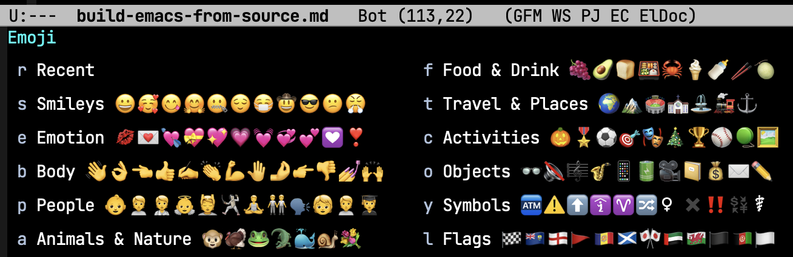

# Emacsをソースからビルドした

Homebrew CaskでインストールしているEmacsのアップデートが失敗したので、初めてソースコードからEmacsをビルドした。備忘録を残しておく。

## きっかけ

昨日（11/22） `brew upgrade` でEmacsをアップデートしたら、

> This application will not run on your computer. Sorry!

というメッセージが表示されて、起動できなくなった。

[Masafumi Koba 🇺🇦 on Twitter: "brew upgrade したらEmacsが起動できなくなって焦ってる💦" / Twitter](https://twitter.com/ybiquitous/status/1462691859482877954)

エラーメッセージでググると、バージョン `27.2-3` へのアップデートで[同じエラーに遭遇](https://github.com/Homebrew/homebrew-cask/pull/114603#issuecomment-974360530)してる人がいた。
ブツブツつぶやいてたら[@jimlock](https://twitter.com/jimlock)さんが反応してくれてソースビルドを勧めてくれたので、やってみることにした。
（[@jimlockさんのブログ](https://jinroq.hatenablog.jp/entry/2021/11/20/101235)も参考にした。感謝）

## 環境

OSは **macOS Big Sur** [^1]。バージョンは次の通り。

```console
$ system_profiler SPSoftwareDataType | grep Version
      System Version: macOS 11.6 (20G165)
      Kernel Version: Darwin 20.6.0p
```

## ソースダウンロード

まず、GitHubの[ミラーリポジトリ](https://github.com/emacs-mirror/emacs)からダウンロードした。
リビジョンは [`2955d46`](https://github.com/emacs-mirror/emacs/tree/2955d46c00430b38310d0fae968adea91e2bbc3d)。

```console
$ git fast-clone https://github.com/emacs-mirror/emacs.git
```

> [!NOTE]
> `git fast-clone` は[独自エイリアス](./git-partial-clone.md)であることに注意。

## ビルド準備

`./configure` が見つからなかったので少し焦ったが、上記ブログに `autogen.sh` スクリプトを実行すると書いてあった。
（あとで調べたら [`INSTALL.REPO`](https://github.com/emacs-mirror/emacs/blob/2955d46c00430b38310d0fae968adea91e2bbc3d/INSTALL.REPO) にも書いてあった）

```console
$ ./autogen.sh
```

- Homebrewでインストールするものと衝突させたくなかったので、ホームディレクトリにインストールするために `--prefix=$HOME` を指定。
- [`NEWS.28`](https://github.com/emacs-mirror/emacs/blob/2955d46c00430b38310d0fae968adea91e2bbc3d/etc/NEWS.28) を眺めてるとネイティブコンパイルサポートという面白そうな機能を見つけたので、`--with-native-compilation` を指定。

```console
$ ./configure --prefix=$HOME --with-native-compilation
```

実行すると `makeinfo` のバージョンが古いと怒られた。macOSにプリインストールされているバージョンだと古いらしい。

```console
$ /usr/bin/makeinfo --version
makeinfo (GNU texinfo) 4.8
```

Homebrewでインストールできないか探してみると、[`texinfo` というパッケージに含まれている](https://stackoverflow.com/a/44382617)ことがわかった。

```console
$ brew install texinfo
```

インストールしたら、一時的にPATHを通しておく。

```console
$ export PATH="/opt/homebrew/Cellar/texinfo/6.8/bin:${PATH}"
```

再度 `./configure` を実行すると、今度は `libgccjit` が必要だと怒られた。これもHomebrewでインストールした（`gcc` も必要）。

```console
$ brew install gcc libgccjit
```

## ビルド＆インストール

これで `./configure` が成功したので、次は `make` を実行した。

```console
$ make
```

数分待って無事成功したので、次は `make install` を実行した。

```console
$ make install
```

先ほど指定した `--prefix` に指定した場所にインストールされるのかと思いきや、`*.el` をコンパイルしただけっぽかった。

`nextstep/Emacs.app` というパッケージがビルドされたというメッセージが出ていたので、`~/Applications` に移動した。

```console
$ mv nextstep/Emacs.app ~/Applications/
```

これでインストールは完了。あとは、この `Emacs.app` を開けばOK（Finderからも開ける）。

```console
$ open ~/Applications/Emacs.app
```

`*scratch*` バッファでインストールしたバージョンを確認すると、バージョン **29** がインストールされてた。ちょっと感動。

```
(version)
"GNU Emacs 29.0.50 (build 1, aarch64-apple-darwin20.6.0, NS appkit-2022.60 Version 11.6 (Build 20G165))
 of 2021-11-23"
```

## まとめ

必要なライブラリが分からなくて最初は少しハマったが、以降は問題なくインストールできたし、今のところ問題なく動いている。
（このブログもビルドしたEmacsで書いている）

`NEWS` 眺めてると、[Emojiサポート](https://github.com/emacs-mirror/emacs/blob/2955d46c00430b38310d0fae968adea91e2bbc3d/etc/NEWS#L108)のセクションを見つけた。<kbd>C-x 8 e e</kbd>でEmojiを選べるようになってる。便利。



> [!NOTE]
> Emacs 29で公式にサポートされた🎉（[NEWS](https://github.com/emacs-mirror/emacs/blob/emacs-29.1/etc/NEWS#L884)）。
> デフォルトのキープレフィックスは<kbd>C-x 8 e</kbd>。

意外と簡単にビルドできたので、今後も定期的にソースからビルドするつもり。

[^1]: 環境書くの忘れてたので、追記。
