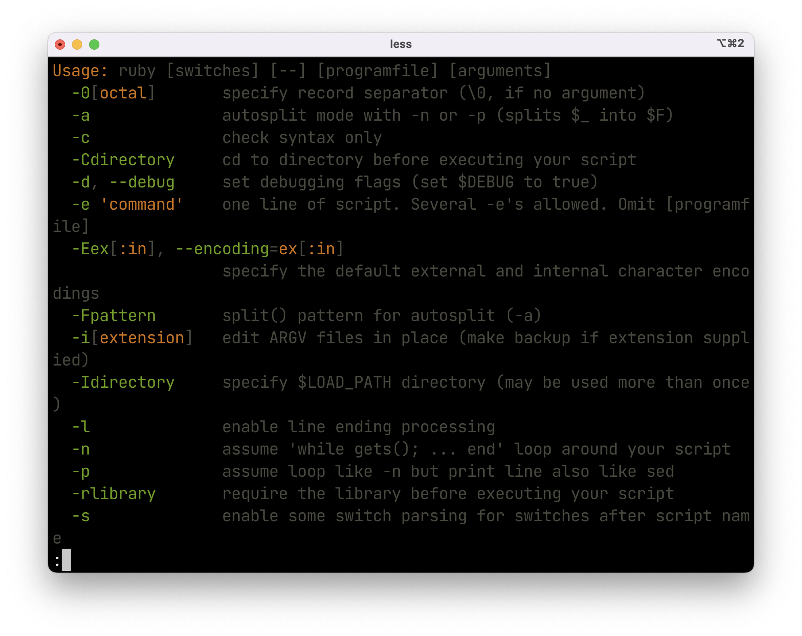

# Highlighting command help via bat(1)

In this post, I introduce a tip that can show a color-highlighting help output for arbitary commands.

## TL;DR

Here is my shell alias `help`:

```sh
if type bat &>/dev/null; then
  alias help='f() { (test $# -ne 0) && ("$@" --help 2>&1 | bat --language cmd-help --style plain) }; f'
fi
```

Here is a usage of the `help` alias for the `ruby` command:

```console
$ help ruby
```



## What is bat(1)

The official description:

> A cat(1) clone with syntax highlighting and Git integration.

It is a Rust-based command line tool. I have used the useful tool for several years, instead of cat(1) or less(1).

## How it works

I have copied and pasted the `help` alias snippet above to my `.zshrc` file.
Let me split this one-liner alias into multi-lines for an explanation as below.

```sh
# Declare a function.
f() {
  # Check if the number of arguments is zero. If it is zero, the function exits immeidately.
  test $# -ne 0

  # Run a given command with the `--help` flag, then the command output is passed to bat(1).
  "$@" --help 2>&1 | bat --language cmd-help --style plain
}

# Call the function.
f
```

Notes:

- `"$@"` accepts sub commands like `help brew install`.
- `--style plain` suppress to output line numbers.

## Limitations

- The alias doesn't support commands without `--help`.
- `help node` (the Node.js command) breaks paging, but I don't know why.

## Resource

See the tip in the [bat(1) README](https://github.com/sharkdp/bat#highlighting---help-messages).
