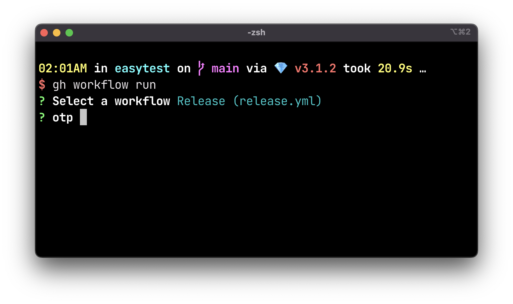

# GitHub ActionsでRuby gemをリリースする

GitHub Actionsを使ったgemのリリース方法についてある程度確立したので、備忘録を残す。

あくまで現時点での最適解と考えている。近い将来変わる可能性は十分にあるし、正直もう少し楽にできたらなとは思う。

## 前提

- Bundlerを使う
- RubyGems.orgのMFAを有効にしてある
- RubyGems.orgのAPIキー取得済み
- APIキーをGitHubリポジトリのシークレットに登録済み

## ワークフローYAML

以下、ワークフローYAMLの全容をペタッと貼る。`.github/workflows/release.yml` などに保存すればよい。

```yaml
name: Release

on:
  workflow_dispatch:
    inputs:
      otp:
        description: "One-time password for RubyGems.org"
        required: true

concurrency:
  group: ${{ github.workflow }}
  cancel-in-progress: true

jobs:
  release:
    runs-on: ubuntu-latest
    permissions:
      contents: write
    steps:
      - name: Checkout
        uses: actions/checkout@v3

      - name: Set up Ruby
        uses: ruby/setup-ruby@v1
        with:
          ruby-version: "3.1"
          bundler-cache: true

      - name: Configure Git
        run: |
          git config --global user.name "${GITHUB_ACTOR}"
          git config --global user.email "${GITHUB_ACTOR}@users.noreply.github.com"

      - name: Publish to gem registry
        run: bundle exec rake release
        env:
          GEM_HOST_API_KEY: ${{ secrets.api-key }}
          GEM_HOST_OTP_CODE: ${{ inputs.otp }}

      - name: Push tag
        run: git push --follow-tags

      - name: Get tag
        run: echo "::set-output name=name::$(git describe --abbrev=0)"
        id: tag

      - name: Create GitHub release
        run: gh release create "${TAG_NAME}" --draft
        env:
          GITHUB_TOKEN: ${{ secrets.GITHUB_TOKEN }}
          TAG_NAME: ${{ steps.tag.outputs.name }}
```

`bundle exec rake release` コマンドは、Gitタグを打ってgemをビルドし、RubyGems.orgにアップロードしてくれる。
タグを打つ前に、`git config` コマンドでコミットユーザとEmailをセットしておくことがミソ。

新たに作られたタグは `git push` しておく必要がある。リポジトリに書き込むので、`permissions.contents: write` も必要。

これでおしまいにしてもいいが、どうせならGitHub Release作成も自動化したい。そこで `git describe --abbrev=0` で最新のGitタグを取得し、[`gh release create`](https://cli.github.com/manual/gh_release_create) コマンドにそのタグを渡してReleaseを作成する。タグの取得のあたりは、もう少し上手い方法があるかもしれない。

公開前に内容を最終確認したいので、`gh release create` にｈ `--draft` オプションを付けるのが好み。
リリース内容はCHANGELOGからコピペしたり、["Generate release notes" ボタン](https://github.blog/2021-10-04-beta-github-releases-improving-release-experience/) でサクッと作ってもよい。CHANGELOGへのリンクだけとかでもいい。

GitHub Releaseが作成されるとRSSやGitHub Notificationsで受け取れるから、なるべく作りたい。

## 実際のワークフロー

実際は、以下のようなワークフローとなる。

1. 次のリリースのために必要なコミットをすべてメインブランチにプッシュする。`VERSION` 定数やCHANGELOGの更新など。
2. CIが成功していることを確認する。これで準備完了。
3. リリース用のGitHub Actionsワークフローを手動で実行する（`workflow_dispatch`）。
    - GitHub.com上のUIから起動できる。`Actions` ページの `Run workflow` ボタン。
    - オススメは [`gh workflow run`](https://cli.github.com/manual/gh_workflow_run) コマンド をターミナルで実行する方法。慣れるとこちらがめちゃくちゃ楽。
    - ワークフロー実行前にOTPを聞かれるので入力する。ターミナルからも入力できる。↓のスクリーンショット参照。
4. あとはジョブが完了するのを待つのみ。
5. ジョブが完了したら、実際にRubyGems.orgに公開されているか確認したり、ドラフトのGitHub Releaseを公開したりして終了。



## 感想

OTPの入力に一手間かかってるので、省略することができれば最高かなと思う。
npmjs.comではOTP省略可能なAPIキーを発行できるので、RubyGems.orgにあればなぁ。

ただ、リリースワークフローの起動を手動で行うのであれば、そんなに手間は変わらない。
別のトリガー（例えばメインブランチへのプッシュとか）に対応したいとなると、OTP入力がブロックになってしまう。

GitHub ActionsとGitHub CLI（`gh`）の組み合わせが強力なので、知識を入れておけば組み合わせ次第である程度のことはできる。

その反面、ActionsのYAML構文が中々覚えられずに何度もググっているのは少しキツイ。
さらに、YAMLを書くのをミスったときにデバッグが大変だから、プッシュする前に [`actionlint`](https://github.com/rhysd/actionlint) でチェックするようにしている。
