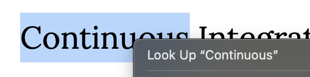

# macOSのFirefoxでLook Up in Dictionary機能を使えるようにする

約半年ぶりにブログを書く気になった。小ネタだが。2024年の一発目。

私はmacOS内蔵の辞書アプリ（Dictionary）を大変重宝しており、英語記事を読む際にわからない単語に出くわすと、必ずと言っていいほど辞書アプリを使っている。

Safariは言わすもがなだが、macOSのChromeでは右クリックするとコンテキストメニュー内に「Look Up "..."」が表示され、辞書にすぐアクセスできる。例えばこのスクリーンショットのように。

しかし、なぜかFirefoxでは「Look Up」が右クリックで出てこない。仕方がないので拡張機能を探すことにした。見つけたのがこちら。

- [Look up dictionary by using Right Click](https://addons.mozilla.org/en-US/firefox/addon/look-up-dict-by-uri-scheme/)
- [Harpseal/LookUp-Dictionary-By-dict-URI-Scheme](https://github.com/Harpseal/LookUp-Dictionary-By-dict-URI-Scheme)

あんまり使われている形跡がないけれど、他に良いのが無さそうだしソースコードがGitHubに公開されているし安心だろうと試しに入れてみたところ、一応問題なく使える。
右クリックでコンテキストメニュー内に「Look Up…」が追加されていることがわかる（下のスクリーンショット）。

さすがにデフォルトでサポートされていてもいいんじゃないかとBugzillaを探してみたところ、以下のチケットを見つけた。

- [301451 - \[meta\] Gecko doesn't support Cmd-Ctrl-D lookup in Mac OS X Dictionary.app](https://bugzilla.mozilla.org/show_bug.cgi?id=301451)
- [1116391 - Add "Look Up in Dictionary" context menu entry \[Mac OS X\]](https://bugzilla.mozilla.org/show_bug.cgi?id=1116391)

最初のチケットは<kbd>Control</kbd>+<kbd>Command</kbd>+<kbd>D</kbd>ショートカットキーに対応したもので、クローズされている。
ちなみに、そのショートカットキーのことはこのブログを書くまで知らなかった。[このページ](https://support.apple.com/en-us/HT201236)にmacOSショートカットキーの一覧が載っている。正直このショートカットキーは覚えにくく、押しにくい。

2番目のチケットがまさに探していたもので、何と9年前にオープンされているがまだクローズされていない。やはりネイティブの人は辞書なんかしょっちゅう使わないので、優先順位が低いのだろうか。個人的にはなんとか実装してほしい。

メモ書き程度にブログに残すつもりが、Bugzillaに該当チケットを探し当てることができたので、やはりブログを書いて損することはないんだなと実感した。以上。
