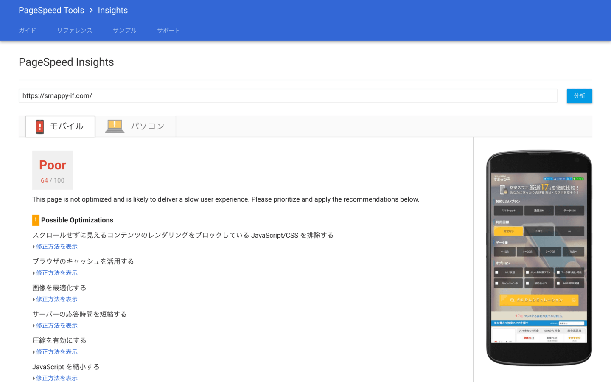
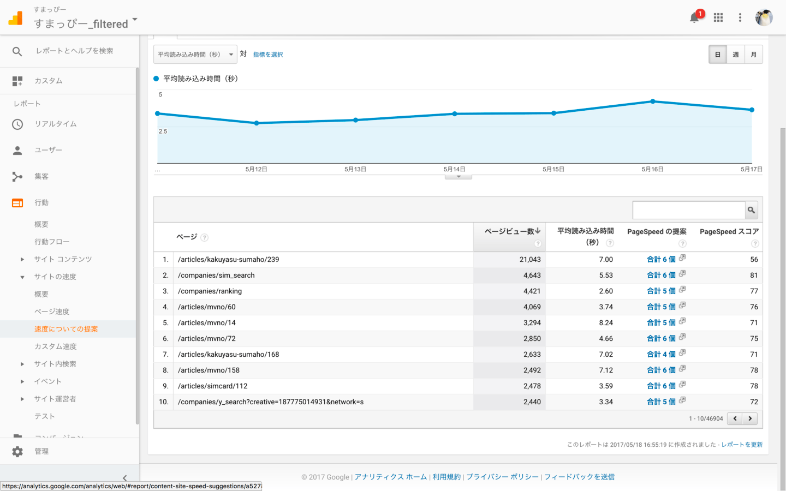
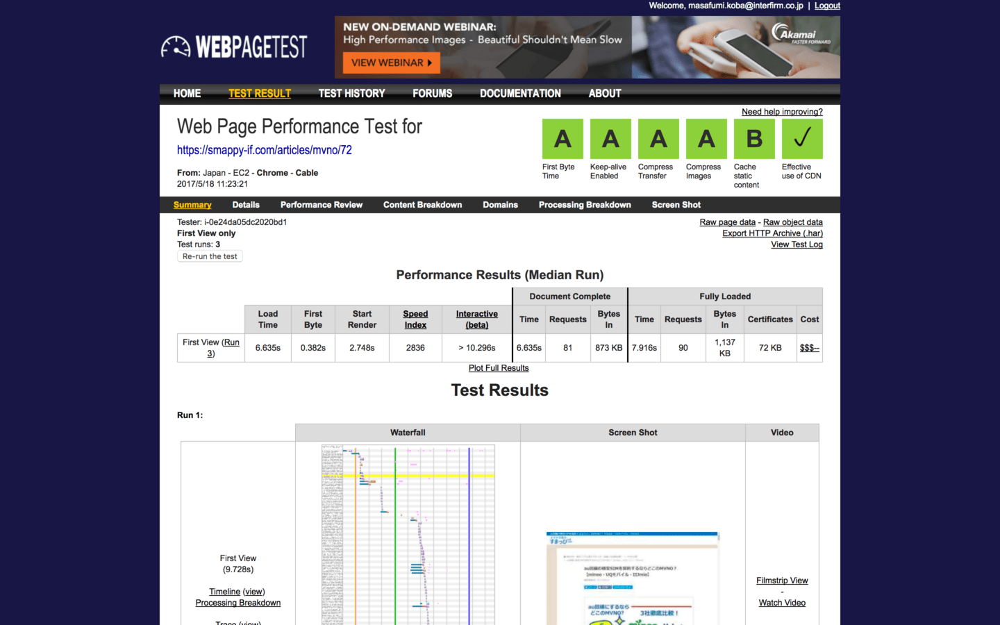
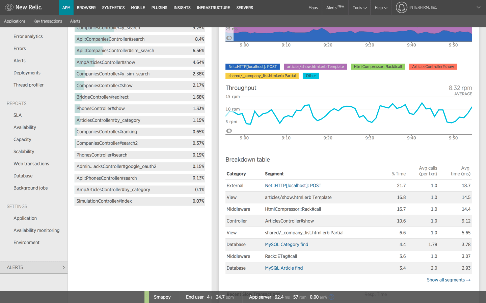
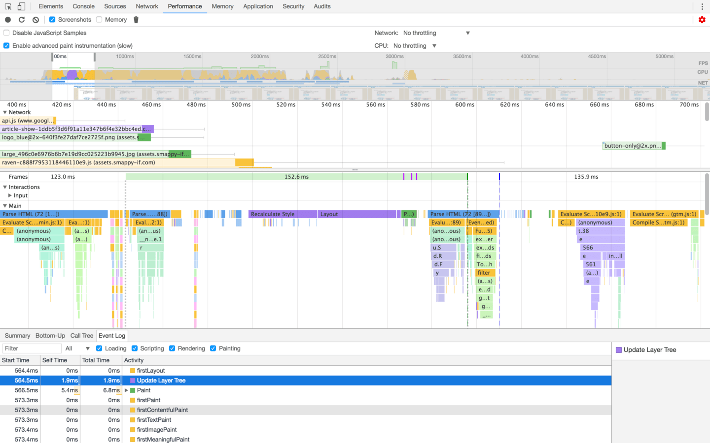
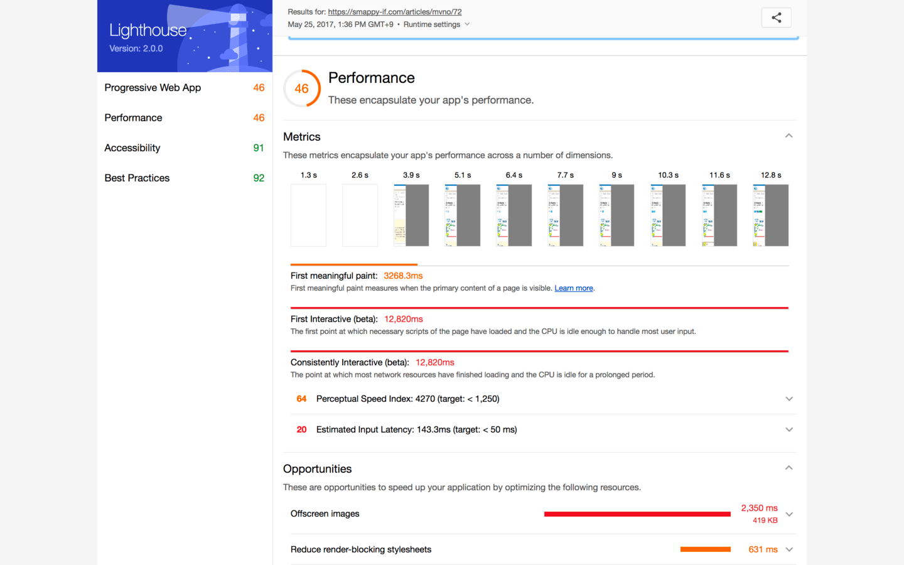
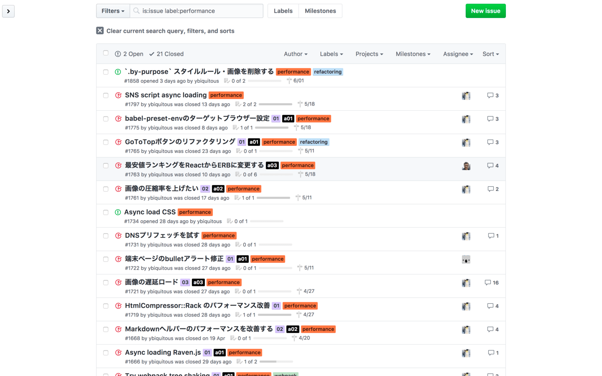
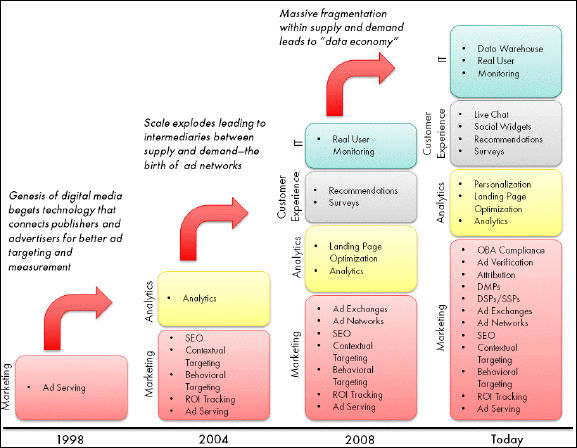

import myThemes from "../theme";

export const themes = myThemes;

import { Head, Image } from "mdx-deck";

<Head>
  <title>サイトスピードを改善する</title>
  <meta name="description" content="Webサイトのページスピードを改善する方法" />
  <meta name="date.created" content="2017-05-25" />
</Head>

# サイトスピードを改善する

---

## サイトスピードは UX

---

## [RAIL モデル](https://developers.google.com/web/fundamentals/performance/rail)

- **R** esponse
- **A** nimation
- **I** dle
- **L** oad

---

- **1 秒以内に**表示する
- **クリティカルレンダリングパス**の最適化
- 1 秒以内に表示されたと**感じられるようにする**

---

### [クリティカルレンダリングパス](https://developers.google.com/web/fundamentals/performance/critical-rendering-path/)

(_Critical Rendering Path_)

---


---

### DOM


---

### CSSOM


---

### レンダリングツリー


---

### レイアウト


---

### ペイント


---

### レンダリングブロックリソース

- CSS
- JavaScript

---

### FOUC (_Flash of Unstyled Content_)


---

### インラインスクリプト

```html
<span>web performance</span>
<script>
  var span = document.getElementsByTagName("span")[0];
  // change DOM text content
  span.textContent = "interactive";
  // change CSSOM property
  span.style.display = "inline";
</script>
```

---

### インラインスクリプトは DOM 構築をブロックする

---

### ブラウザは CSSOM の構築が完了するまでスクリプトの実行を遅らせる

---

### 外部スクリプト

```html
<span>web performance</span>
<script src="app.js"></script>
```

```js
/* app.js */
var span = document.getElementsByTagName("span")[0];
// change DOM text content
span.textContent = "interactive";
// change CSSOM property
span.style.display = "inline";
```

---

### スクリプトの実行完了まで DOM パーサーはブロックされる

---

### async を付ける

```html
<span>web performance</span>
<script src="app.js" async></script>
```

---

### async はブロックしない‼

---

## 測定サービス＆ツール

- PageSpeed Insights
- WebPagetest
- New Relic
- Chrome DevTools
- Lighthouse (Chrome extension)

---

### [PageSpeed Insights](https://developers.google.com/speed/pagespeed/insights)



---

- サイトが見やすく指摘がシンプルなので対応しやすい
- 詳細な計測には向かない
- Google Analytics 対応

---

### [Google Analytics](https://developers.google.com/analytics/)



---

### [WebPagetest](https://www.webpagetest.org/)



---

- サイトがわかりづらい・複雑
- 詳細な計測やボトルネックの測定には向いている
- ビデオや連続スクリーンショットが撮れる

---

### [New Relic](https://newrelic.com/)



---

- サーバーサイド(Rails)の計測に便利
- 一応クライアントサイドの計測もある
- 凝ったことをしようとすると、有料プランが必要

---

### [Chrome DevTools](https://developers.google.com/web/tools/chrome-devtools/)



---

### [Lighthouse](https://developers.google.com/web/tools/lighthouse/)



---

### 実施した対策

- サーバー処理の最適化
- 画像の遅延ロード
- 画像最適化
- CSS/JS ファイルサイズ削減
- JS の非同期ロード (async)

---



---

### サーバー処理の最適化

- **New Relic** でボトルネックを探す
- 無駄な **SQL クエリ** を解決 (N+1, [bullet](https://github.com/flyerhzm/bullet))
- **Markdown** から出力された HTML をキャッシュ
- **HtmlCompressor::Rack** の設定を見直し

---

### 画像の遅延ロード

(特にプラグインは入れなかった)

```js
// 

const images = document.querySelectorAll("img[data-src]");

for (const image of images) {
  image.setAttribute("src", image.getAttribte("data-src"));
  image.removeAttribute("data-src");
}
```

---

### 画像最適化

- ファイルサイズ削減 (最適化レベルを上げる)
- Progressive JPEG
- [Piet](https://github.com/albertbellonch/piet) + [jpegoptim](https://github.com/tjko/jpegoptim)
- コマンドラインオプションを調整

---

### CSS/JS ファイルサイズ削減

- アプリケーションで 1 つのファイルにバンドルしていた → ページ別のファイルに分割
- application.css → pages/\*.css
- application.js → pages/\*.js

---

### JS の非同期ロード (async)

- jQuery 依存を削除 (コードと GTM から)
- 依存ライブラリを Vanilla JS で書き換え
- 3rd-party スクリプト (Raven, Facebook, Twitter, etc.)を `async` に

---

## サードパーティタグ (3rd-party Tag)

---



[Third party tagging evolution](http://www.digitalmarketing-glossary.com/What-is-Third-party-tag-definition)

---

> Web ページの遅延原因の**80%**はサードパーティから読み込むリソースにあります。

[HTML5 Experts.jp](https://html5experts.jp/shumpei-shiraishi/22028/)

---

# Thanks!
